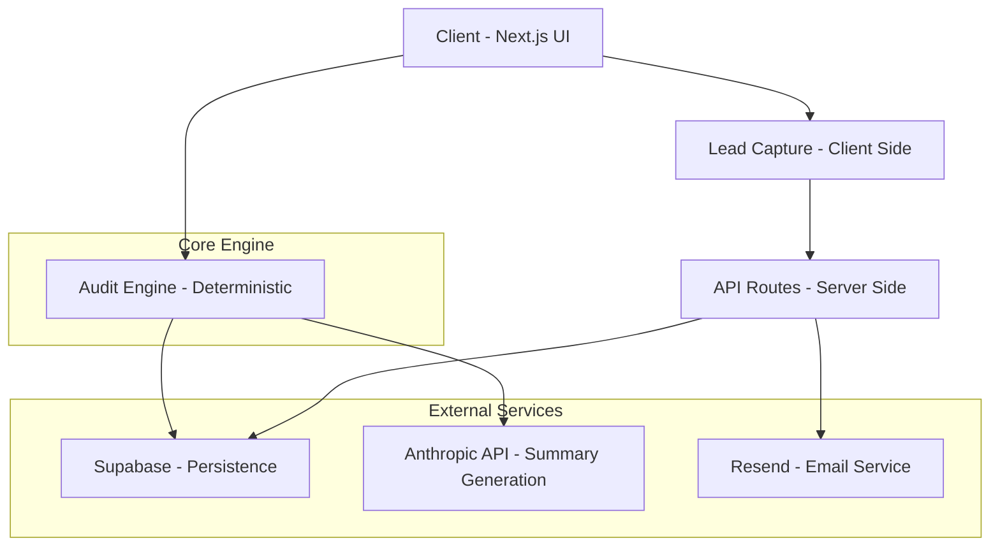

# System Architecture

This document outlines the architectural decisions and data flow within the AI Spend Audit platform.

## 🏗 High-Level Design

The application follows a **Service-Oriented Architecture** within a Next.js framework, prioritizing deterministic business logic over probabilistic AI outputs for financial calculations.

## 🛠 Component Breakdown

### 1. The Audit Engine (`src/services/audit-engine.ts`)
The "brain" of the application. It is a pure function that takes `AuditInput` and produces `AuditResult`. 
- **Rule-Based**: Uses a collection of `AuditRule` objects to evaluate data.
- **Stateless**: Does not persist data itself, making it easily testable.

### 2. Data Layer (`src/data/pricing.ts`)
A centralized, versioned repository of AI tool pricing. 
- **Strong Typing**: Every tool adheres to the `AIToolPricing` interface.
- **Scalability**: New tools can be added by simply appending a new record to the `AI_TOOLS_PRICING` constant.

### 3. Backend Persistence (Supabase)
We use Supabase for its real-time capabilities and built-in RLS.
- **Audits Table**: JSONB storage for flexible tool configurations.
- **Share Tokens**: High-entropy tokens for secure public report access.

## 📡 Data Flow: Running an Audit

1. **Input**: User submits the multi-step form (`AuditForm`).
2. **Analysis**: The `AuditEngine` processes the input against `AI_TOOLS_PRICING`.
3. **Enrichment**: An asynchronous call is made to the `/api/generate-summary` route.
4. **AI Generation**: Claude Haiku generates a personalized summary based on the audit's findings.
5. **Persistence**: The result is saved to Supabase via `/api/audit/save`.
6. **Visualization**: The user is redirected to the `AuditDashboard`.

## 🔒 Security & Privacy

- **RLS (Row Level Security)**: Ensures public reports are only accessible via their unique IDs and are explicitly marked as public.
- **Honeypot Protection**: The lead capture form includes a hidden honeypot field to mitigate bot spam without requiring friction-heavy CAPTCHAs.
- **Deterministic Accuracy**: We never let AI calculate financial savings. AI is only used for textual summarization.
