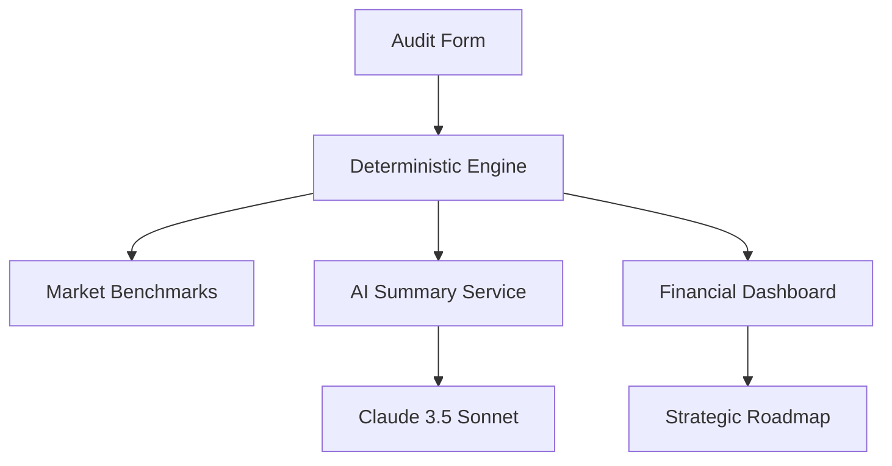

# ⚡️ Credex: AI Capital Optimization Engine

[](https://github.com/credex-operations/ai-spend-audit/actions/workflows/ci.yml)
[](https://nextjs.org/)
[](https://www.typescriptlang.org/)
[](https://opensource.org/licenses/MIT)

**Credex** is an institutional-grade financial auditing platform designed for Series A+ startups and enterprises to optimize their AI operational overhead. By combining deterministic financial intelligence with strategic AI summaries, Credex transforms simple spend tracking into a competitive capital allocation advantage.

[**Run a Verified Audit →**](https://credex.so/audit)

---

## 🚀 Key Features

- **Institutional Audit Engine**: Deterministic analysis of AI spend across 10+ providers (OpenAI, Anthropic, Cursor, etc.).
- **Strategic Benchmarking**: Verify your operational efficiency against market percentiles for teams of your scale.
- **Redundancy Detection**: Automatically identify overlapping subscriptions (e.g., ChatGPT vs. Claude) and seat over-provisioning.
- **Executive Summaries**: High-fidelity strategic roadmaps generated by Claude 3.5 Sonnet.
- **Enterprise Lead Flow**: Professional lead capture for custom implementation roadmaps.

## 🏗 System Architecture

The platform is built on a **Deterministic-First** architecture, ensuring financial figures are always calculated with 100% precision, while AI is utilized for qualitative strategic synthesis.



## 🛠 Tech Stack

- **Framework**: [Next.js 14 (App Router)](https://nextjs.org/)
- **Logic**: TypeScript with [Zod](https://zod.dev/) validation
- **Styling**: Tailwind CSS with custom Glassmorphism tokens
- **Persistence**: [Supabase](https://supabase.com/) (Auth & PostgreSQL)
- **AI Intelligence**: [Claude 3.5 Sonnet](https://www.anthropic.com/claude)
- **Analytics**: Custom SVG visualization engine
- **Communications**: [Resend](https://resend.com/)

---

## 🏁 Getting Started

### Prerequisites

- Node.js 20.x
- npm or pnpm

### Local Installation

1. **Clone the repository**:
   ```bash
   git clone https://github.com/your-username/credex.git
   cd credex
   ```

2. **Install dependencies**:
   ```bash
   npm install
   ```

3. **Configure Environment**:
   ```bash
   cp .env.example .env.local
   # Populate .env.local with your keys
   ```

4. **Initialize Supabase**:
   ```bash
   npx supabase login
   npx supabase init
   ```

5. **Launch Development Server**:
   ```bash
   npm run dev
   ```

---

## 🧪 Testing & Quality

We maintain a 0-compilation-error policy. Every PR is verified against:
- **Type Safety**: `npx tsc --noEmit`
- **Linting**: `npm run lint`
- **Unit Tests**: `npm test` (Powered by Vitest)

## 📄 Documentation

- [Architecture Guide](ARCHITECTURE.md)
- [Development Log](DEVLOG.md)
- [Project Reflection](REFLECTION.md)
- [Market Benchmarks Methodology](METRICS.md)

---

## 🤝 Contributing

Contributions are welcome for adding new AI provider pricing models or improving audit heuristics. Please see the [Contributing Guide](CONTRIBUTING.md).

## 🛡 License

Distributed under the MIT License. See `LICENSE` for more information.

---

<p align="center">
  Built for founders, by founders. <br/>
  <strong>Credex Operations © 2026</strong>
</p>
